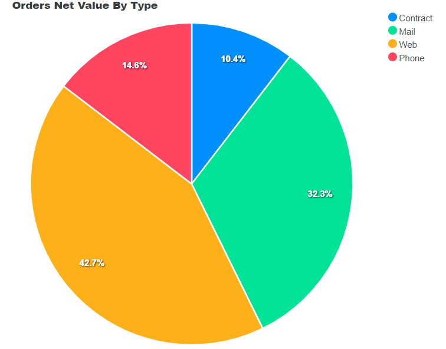

# Blazor-ApexCharts
A blazor wrapper for [ApexCharts.js](https://apexcharts.com/)
## [Demo](https://joadan.github.io/Blazor-ApexCharts/basic-charts)

**Please note: Not (yet) production ready.**


## Installation
### Nuget
[Blazor-ApexCharts](https://www.nuget.org/packages/Blazor-ApexCharts/)

```bash
dotnet add package Blazor-ApexCharts
```

## Usage

### Assets
In `_Host.cshtml` (server-side) or in `index.html` (client-side) add the following lines to the `body` tag **after** the `_framework` reference

```html
<script src="_content/Blazor-ApexCharts/js/apex-charts.min.js"></script>
<script src="_content/Blazor-ApexCharts/js/blazor-apex-chart.js"></script>
```

### Imports
Add a reference to `Blazor-ApexCharts` in your `_Imports.razor`
```csharp
@using ApexCharts;
```
### Basic  Chart
```html
 <ApexChart TItem="Order" Title="Orders Net Value By Type"  ChartType="ChartType.Pie">
            <ApexSeries TItem="Order"
                        Items="SampleData.GetOrders()"
                        Name="Order Value"
                        XValue="@(e => e.OrderType)"
                        YAggregate="@(e => e.Sum(e => e.NetValue))"
                        ShowDataLabels="true" />
        </ApexChart>
```



### Chart Options
Apex Chart options is available in the ApexChartOptions class that can be passed to the chart. More info in Apex documentation [ApexCharts Docs](https://apexcharts.com/docs/options/). See sample below

### Chart Events

```csharp
 
```


**Order Class**
```csharp
    public class Order
    {
        public Guid OrderId { get; set; } = Guid.NewGuid();
        public string CustomerName { get; set; }
        public string Country { get; set; }
        public DateTimeOffset OrderDate { get; set; }
        public OrderType OrderType { get; set; }
        public decimal GrossValue { get; set; }
        public decimal NetValue { get =>  GrossValue * (1 - (DiscountPrecentage / 100)) ; }
        public decimal DiscountPrecentage { get; set; }
    }

   public enum OrderType
    {
        Web, Contract, Mail, Phone
    }
```

**Order Data**
```csharp
  public static class SampleData
    {
        public static List<Order> GetOrders()
        {
            var orders = new List<Order>();
            orders.Add(new Order { CustomerName = "Odio Corporation", Country = "Sweden", OrderDate = DateTimeOffset.Now.AddDays(-12), GrossValue = 34531, DiscountPrecentage = 21, OrderType = OrderType.Contract });
            orders.Add(new Order { CustomerName = "Odio Corporation", Country = "Sweden", OrderDate = DateTimeOffset.Now.AddDays(-100), GrossValue = 2800, DiscountPrecentage = 12, OrderType = OrderType.Mail });
            orders.Add(new Order { CustomerName = "Odio Corporation", Country = "Sweden", OrderDate = DateTimeOffset.Now.AddDays(-128), GrossValue = 12532, DiscountPrecentage = 24, OrderType = OrderType.Contract });
            orders.Add(new Order { CustomerName = "Odio Corporation", Country = "Sweden", OrderDate = DateTimeOffset.Now.AddDays(-232), GrossValue = 1400, DiscountPrecentage = 12, OrderType = OrderType.Mail });
            orders.Add(new Order { CustomerName = "Odio Corporation", Country = "Sweden", OrderDate = DateTimeOffset.Now.AddDays(-321), GrossValue = 22000, DiscountPrecentage = 10, OrderType = OrderType.Contract });
            orders.Add(new Order { CustomerName = "Odio Corporation", Country = "Sweden", OrderDate = DateTimeOffset.Now.AddDays(-400), GrossValue = 3000, DiscountPrecentage = 17, OrderType = OrderType.Web });

            orders.Add(new Order { CustomerName = "Nascetur AB", Country = "Sweden", OrderDate = DateTimeOffset.Now.AddDays(-17), GrossValue = 2134, DiscountPrecentage = 10, OrderType = OrderType.Phone });
            orders.Add(new Order { CustomerName = "Nascetur AB", Country = "Sweden", OrderDate = DateTimeOffset.Now.AddDays(-27), GrossValue = 11345, DiscountPrecentage = 12, OrderType = OrderType.Phone });
            orders.Add(new Order { CustomerName = "Nascetur AB", Country = "Sweden", OrderDate = DateTimeOffset.Now.AddDays(-124), GrossValue = 122345, DiscountPrecentage = 32, OrderType = OrderType.Mail });
            orders.Add(new Order { CustomerName = "Nascetur AB", Country = "Sweden", OrderDate = DateTimeOffset.Now.AddDays(-299), GrossValue = 1235, DiscountPrecentage = 12, OrderType = OrderType.Mail });
            orders.Add(new Order { CustomerName = "Nascetur AB", Country = "Sweden", OrderDate = DateTimeOffset.Now.AddDays(-372), GrossValue = 44000, DiscountPrecentage = 11, OrderType = OrderType.Phone });
            orders.Add(new Order { CustomerName = "Nascetur AB", Country = "Sweden", OrderDate = DateTimeOffset.Now.AddDays(-410), GrossValue = 17000, DiscountPrecentage = 5, OrderType = OrderType.Phone });

            orders.Add(new Order { CustomerName = "Justo Eu Institute", Country = "Spain", OrderDate = DateTimeOffset.Now.AddDays(-13), GrossValue = 2800, DiscountPrecentage = 12, OrderType = OrderType.Mail });
            orders.Add(new Order { CustomerName = "Justo Eu Institute", Country = "Spain", OrderDate = DateTimeOffset.Now.AddDays(-45), GrossValue = 12532, DiscountPrecentage = 24, OrderType = OrderType.Web });
            orders.Add(new Order { CustomerName = "Justo Eu Institute", Country = "Spain", OrderDate = DateTimeOffset.Now.AddDays(-60), GrossValue = 1400, DiscountPrecentage = 12, OrderType = OrderType.Mail });
            orders.Add(new Order { CustomerName = "Justo Eu Institute", Country = "Spain", OrderDate = DateTimeOffset.Now.AddDays(-150), GrossValue = 22000, DiscountPrecentage = 10, OrderType = OrderType.Web });
            orders.Add(new Order { CustomerName = "Justo Eu Institute", Country = "Spain", OrderDate = DateTimeOffset.Now.AddDays(-200), GrossValue = 3000, DiscountPrecentage = 17, OrderType = OrderType.Web });

            orders.Add(new Order { CustomerName = "Ani Vent", Country = "France", OrderDate = DateTimeOffset.Now.AddDays(-17), GrossValue = 2134, DiscountPrecentage = 10, OrderType = OrderType.Phone });
            orders.Add(new Order { CustomerName = "Ani Vent", Country = "France", OrderDate = DateTimeOffset.Now.AddDays(-27), GrossValue = 11345, DiscountPrecentage = 12, OrderType = OrderType.Phone });
            orders.Add(new Order { CustomerName = "Ani Vent", Country = "France", OrderDate = DateTimeOffset.Now.AddDays(-124), GrossValue = 122345, DiscountPrecentage = 32, OrderType = OrderType.Mail });
            
            orders.Add(new Order { CustomerName = "Cali Inc", Country = "France", OrderDate = DateTimeOffset.Now.AddDays(-10), GrossValue = 77000, DiscountPrecentage = 17, OrderType = OrderType.Web });
            orders.Add(new Order { CustomerName = "Cali Inc", Country = "France", OrderDate = DateTimeOffset.Now.AddDays(-110), GrossValue = 120000, DiscountPrecentage = 23, OrderType = OrderType.Web });
            orders.Add(new Order { CustomerName = "Cali Inc", Country = "France", OrderDate = DateTimeOffset.Now.AddDays(-243), GrossValue = 44000, DiscountPrecentage = 8, OrderType = OrderType.Web });

            return orders;
        }
    }
```
<!--stackedit_data:
eyJoaXN0b3J5IjpbLTg4MDUyMjc3N119
-->